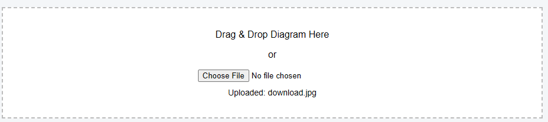
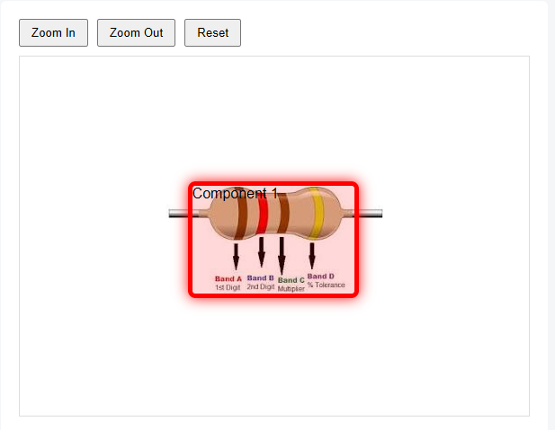
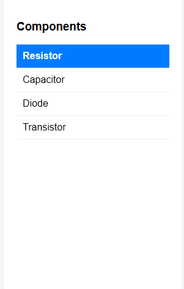

# techvruk

## Diagram Dashboard

This project demonstrates a modular React architecture with reusable components and clean state management using React hooks.

A simple React dashboard where users can upload a diagram and view detected components.  
The application allows zooming into the diagram and highlights components when they are selected from the sidebar.

This project was built as a frontend assessment to demonstrate React fundamentals, UI design, and component-based architecture.

---

# Features

• Upload diagram image (PNG / JPG)  
• Drag & Drop image upload  
• Image preview after upload  
• Zoom In / Zoom Out / Reset controls  
• Sidebar showing circuit components  
• Highlight selected component inside the diagram viewer  
• Responsive layout (desktop and tablet)

---

# Tech Stack

React (Functional Components)  
React Hooks (useState, useEffect)  
CSS  
Vite

# Installation & Setup

1.git clone https://github.com/yourusername/diagram-dashboard.git

2.Navigate to the project folder  => cd diagram-dashboard

3.Install dependencies => npm install

4.Run the development server  => npm run dev

5.Open the application in your browser-http://localhost:5173

---

## Application Workflow

1. Upload a diagram image using drag & drop or file upload.
2. The uploaded diagram appears in the diagram viewer.
3. The sidebar displays a list of components.
4. When a component is clicked, it becomes highlighted in the sidebar.
5. The diagram viewer visually highlights the selected component.

---

## Author

**Karan Kumar**

## Screenshots

### Upload Diagram

---

### Diagram Viewer

---

### Component Highlight

